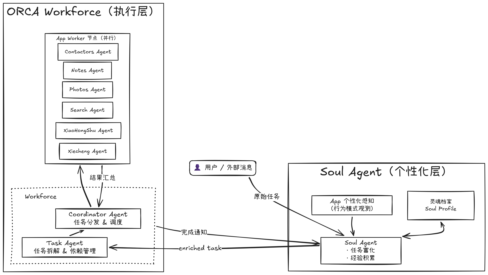

# ORCA-Hermes Soul Runtime

ORCA-Hermes 是在 AIOS/ORCA 多智能体操作系统原型上接入 Hermes 后形成的实验项目。当前版本的设计边界很明确：**只把系统入口的 Soul Agent 换成 Hermes，Workforce、Coordinator、Task Agent 和各 App Agent 继续沿用 Camel/AIOS 执行框架**。

换句话说，Hermes 不作为每个 App 的执行器，也不替代整个 Camel Workforce。它更适合承担系统的“认知中枢”：理解用户、读取长期画像、主动澄清缺失信息、生成 enriched task，然后把可执行任务交给 Camel Workforce 调度其他 Agent 完成。

```text
User / OS View
  -> Hermes Soul Agent
  -> enriched task
  -> Camel Workforce
  -> Camel App Agents
  -> App tools / mock data
  -> result / confirmation / memory update
```

## 当前能力

- Hermes 作为 Soul Agent 运行，负责个性化理解、任务补全、澄清提问和任务交接。
- Camel Workforce 继续负责任务拆解、Worker 匹配、依赖管理、结果汇总和失败恢复。
- App Agent 已覆盖通讯录、备忘录、相册、小红书、携程、搜索、文档和开发工具等能力。
- OS View 提供手机式交互界面，支持小艺面板、任务进度、确认弹窗、通知和 App 数据展示。
- Hermes Soul 通过 MCP 工具访问用户画像、经历、任务状态和用户澄清能力。
- AIOS、Camel、Hermes client 和 Hermes ACP 子进程共用一个 Python 3.11 环境，避免多个虚拟环境互相割裂。

## 架构说明

### Hermes Soul 认知层

Soul Agent 是系统入口。它接收用户自然语言任务后，会结合 `mock_data/soul` 中的用户画像、长期经历以及各 App 的行为观察信息，判断任务是否完整、是否需要授权、是否涉及外部可见动作。对于发布小红书、发送消息、删除数据、修改长期画像等高影响任务，Soul 会先通过 OS View 或命令行向用户确认，再生成 enriched task。

### Camel Workforce 执行层

Workforce 接收 enriched task 后再进行拆解和调度。Coordinator 负责选择合适的 Worker，Task Agent 负责子任务规划，各 App Agent 只处理自己应用边界内的工具调用。执行层不需要理解 Hermes 的内部记忆结构，只需要接收清晰的目标、约束、应用范围和确认状态。

### App 工具层

各 App 工具读取 `mock_data` 中的演示数据，或写入本地模拟结果。例如相册工具检索照片，小红书工具生成本地发布记录，通讯录工具维护 D2D 消息历史，备忘录工具读写笔记。默认演示不连接真实手机系统或真实第三方账号。

<div align="center">
  
</div>

## 快速开始

### 1. 准备前置条件

推荐环境：

- Linux/macOS
- Conda，或本机可用的 Python 3.11
- 本地 Hermes agent 源码目录，默认位置为 `$HOME/.hermes/hermes-agent`
- 可访问的 OpenAI-compatible 模型服务

如果 Hermes agent 不在默认位置，先设置：

```bash
export AIOS_HERMES_AGENT_ROOT=/path/to/hermes-agent
```

### 2. 创建统一环境

```bash
cd aios_soul
./scripts/setup_aios_hermes.sh
```

脚本会优先创建或更新 Conda 环境 `aios-hermes`。如果没有 Conda，会尝试用 `python3.11` 创建 `.venv-aios-hermes`。这一个环境会同时安装：

- 本项目依赖
- 本地 `camel-master`
- 本地 Hermes agent 的 `acp` 和 `web` 依赖

脚本首次运行时会从 `example.env` 复制出 `.env`。`.env` 是本机配置文件，已经被 `.gitignore` 忽略。

### 3. 进入环境并检查

如果使用 Conda：

```bash
conda activate aios-hermes
python scripts/hermes_doctor.py
```

如果使用本地 venv：

```bash
.venv-aios-hermes/bin/python scripts/hermes_doctor.py
```

检查通过时会输出 `Hermes Soul runtime looks usable.`。如果提示找不到 Hermes agent，确认 `AIOS_HERMES_AGENT_ROOT` 指向了包含 `pyproject.toml` 的 Hermes agent 源码目录。

### 4. 启动 OS View

```bash
./scripts/run_os_view_hermes.sh
```

启动后访问：

```text
http://127.0.0.1:5001
```

脚本会自动设置：

- `AIOS_AGENT_RUNTIME=hermes`
- `AIOS_HERMES_PYTHON` 为当前 Python 3.11 环境
- `AIOS_HERMES_RUNTIME_DIR` 为项目内的 `runtime/hermes`

因此 setup 完成后，通常只需要进入 `aios-hermes` 环境再运行启动脚本。启动脚本本身也会尝试自动激活 Conda 环境。

### 5. 启动命令行 Demo

```bash
./scripts/run_demo_hermes.sh
```

该入口运行 `demo/aios_demo.py`，适合快速验证 Hermes Soul 是否能先生成 enriched task，再由 Camel Workforce 执行。

## 环境变量

主要配置项在 `.env` 中维护。

| 变量 | 默认值 | 说明 |
| --- | --- | --- |
| `AIOS_AGENT_RUNTIME` | `hermes` | Soul Agent runtime，支持 `hermes` 或 `camel` |
| `AIOS_HERMES_FALLBACK` | `on_error` | Hermes 失败时是否回退到 Camel Soul，可选 `never`、`on_error`、`on_empty`、`always` |
| `AIOS_HERMES_HOME` | `$HOME/.hermes` | Hermes 全局工作目录，留空时由脚本补默认值 |
| `AIOS_HERMES_AGENT_ROOT` | `$HOME/.hermes/hermes-agent` | Hermes agent 源码目录 |
| `AIOS_HERMES_RUNTIME_DIR` | `runtime/hermes` | 本项目的 Hermes 运行数据目录 |
| `AIOS_HERMES_MAX_TURNS` | `12` | 限制 Hermes Soul 的单任务轮数 |
| `AIOS_SOUL_MAX_CLARIFICATIONS` | `2` | Soul 单任务最多主动澄清次数 |
| `AIOS_SOUL_DEFAULT_REPLY` | `你自己发挥` | 非交互场景下的默认用户回复 |
| `AIOS_AUTO_CONFIRM_PUBLISH` | `1` | Demo 中是否自动确认小红书模拟发布 |
| `ORCA_PORT` | `5001` | OS View 服务端口 |
| `AIOS_MODEL_TYPE` | `qwen3.6-27b` | 默认模型名 |
| `url` / `OPENAI_BASE_URL` | 项目默认 endpoint | OpenAI-compatible 模型服务地址 |
| `OPENAI_API_KEY` / `QWEN_API_KEY` | 空 | 模型服务 key，本机写入 `.env` |

模型配置由 `agents/backend_model.py` 统一读取。当前默认模型名为 qwen3.6-27b，默认 endpoint 指向项目测试服务；API key 不写入仓库，需要在本机 `.env` 中配置。

## 项目结构

```text
aios_soul/
├── agents/                    # Soul、Coordinator、Task 和各 App Agent
│   ├── soul_agent.py          # runtime factory：Camel Soul 或 Hermes Soul
│   ├── hermes_runtime.py      # AIOS 侧 Hermes Soul 封装
│   ├── runtime.py             # runtime 开关读取
│   └── backend_model.py       # 统一模型配置
├── camel-master/              # Camel/AIOS 多智能体执行框架
├── demo/
│   ├── aios_demo.py           # 命令行任务入口
│   ├── aios_listener.py       # D2D 消息监听入口
│   └── os_view/               # 手机式 UI 和 Flask 后端
├── hermes_platform/           # Hermes platform facade、agent 管理和 world model 封装
├── mcp_servers/
│   └── soul_mcp_server.py     # Hermes Soul 可调用的 MCP 工具服务
├── mock_data/                 # 演示用户、App 数据和模拟结果
├── scripts/
│   ├── setup_aios_hermes.sh   # 一键创建/更新统一环境
│   ├── run_os_view_hermes.sh  # Hermes Soul + OS View 启动入口
│   ├── run_demo_hermes.sh     # Hermes Soul + CLI Demo 启动入口
│   ├── hermes_doctor.py       # Hermes 环境检查
│   └── load_photos.py         # 相册数据预处理
├── tools/                     # App 工具和 Soul 数据访问工具
├── test/                      # Agent 单元测试
├── README_HERMES.md           # Hermes Soul 专项说明
├── environment-aios-hermes.yml
├── requirements-unified-py311.txt
└── example.env
```

## Mock 数据

演示数据集中在 `mock_data/`：

```text
mock_data/
├── soul/              # 当前用户画像和长期经历
├── contactors/        # 通讯录和消息历史
├── notes/             # 备忘录
├── photos/            # 相册图片和图片索引
├── xiaohongshu/       # 小红书偏好和模拟发布记录
├── xiecheng/          # 携程订单、攻略和景点数据
└── aihua/             # 艾华老师示例数据集
```

`mock_data/soul/soul.json` 是当前服务对象的核心画像。Hermes Soul 会把该画像转换为可读上下文，也会通过 MCP 工具读取完整画像和经历列表。任务完成后，如果产生新的稳定偏好或经历，可以写回 `mock_data/soul`。

相册首次使用前可以运行：

```bash
python scripts/load_photos.py
```

## OS View 使用方式

OS View 启动后，浏览器中会显示一个手机式界面。右侧悬浮按钮打开小艺面板，用户可以输入自然语言任务。典型任务示例：

```text
我去云南玩了，帮我看看相册有没有风景照，去携程看看旅游攻略，写个帖子发到小红书。
```

推荐观察点：

- Hermes Soul 是否先理解用户意图并补齐任务上下文。
- 对发布、发送消息等外部可见动作，Soul 是否在 handoff 前主动澄清或确认。
- Workforce 是否把任务拆给相册、携程、小红书等对应 App Agent。
- App Agent 是否只在自身应用边界内执行。
- 最终结果是否回到 OS View，并记录任务状态。

## D2D 消息监听

命令行启动：

```bash
python demo/aios_listener.py
```

监听地址来自 `mock_data/soul/soul.json` 中的 `aios_phone_number` 字段。收到外部消息后，系统会进入同一条 Soul 到 Workforce 流程，由 Soul 判断是否回复、如何回复，再由执行层查询数据并完成发送。

## 测试与检查

轻量语法检查：

```bash
python -m py_compile \
  agents/backend_model.py \
  agents/soul_agent.py \
  agents/hermes_runtime.py \
  agents/runtime.py \
  mcp_servers/soul_mcp_server.py \
  scripts/hermes_doctor.py
```

运行单元测试：

```bash
python -m pytest test/agent
```

部分测试和 Demo 会调用模型服务或读取 mock 数据。若模型服务不可用，先运行 `python scripts/hermes_doctor.py` 和一个最小 CLI Demo 定位环境问题。

## 常见问题

### setup 后是否只需要一个环境？

是。当前推荐使用统一的 Python 3.11 环境 `aios-hermes`。AIOS 业务代码、Camel Workforce、Hermes client 代码和 Hermes ACP 子进程都通过同一个 Python 运行。旧的 AIOS Python 3.10 环境不再适合作为 Hermes Soul 模式的主环境。

### 为什么只让 Soul 使用 Hermes？

Hermes 具备更强的长期记忆、角色化上下文和主动澄清能力，适合做系统入口的认知中枢。App Agent 更适合保持轻量、边界清晰、工具权限明确。把每个 App Agent 都替换为 Hermes 会让系统变重，也会增加权限扩散和状态不一致风险。

### Hermes 失败后为什么任务还能继续？

默认 `AIOS_HERMES_FALLBACK=on_error`。当 Hermes Soul 报错时，系统会回退到原 Camel Soul，以保证 Demo 可跑。严格验证 Hermes 时可以改为：

```env
AIOS_HERMES_FALLBACK=never
```

### 小红书发布会真的发到平台吗？

不会。当前小红书工具会在本地生成模拟发布 JSON。新生成的 `mock_data/xiaohongshu/xhs_post_*.json` 已被 `.gitignore` 忽略。

### runtime 目录是否需要提交？

不需要。`runtime/`、`demo/working_dir/`、`workspace/`、Hermes 日志和临时任务状态都是运行产物，已经被 `.gitignore` 忽略。

## 提交前检查

提交到外部仓库前建议执行：

```bash
git status --short
python scripts/hermes_doctor.py
python -m py_compile agents/backend_model.py agents/soul_agent.py agents/hermes_runtime.py agents/runtime.py
```

确认 `.env`、`runtime/`、`demo/working_dir/`、`__pycache__/`、新生成的 `xhs_post_*.json` 没有进入 Git 状态。

如果要推送到 Await-987 名下仓库，可在本地确认仓库地址后执行：

```bash
git remote add await git@github.com:Await-987/aios_soul.git
git push -u await main
```

如果远端仓库名称不是 `aios_soul`，把 URL 中的仓库名替换为实际名称。
