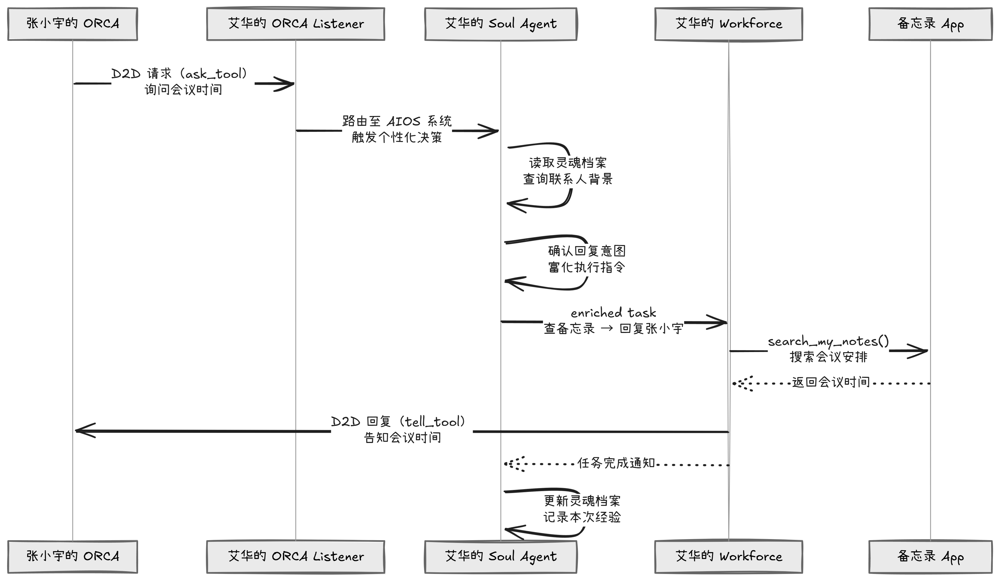

<div align="center">


# ORCA(On-device Reasoning Collaborative Agents)

**多智能体的 AI 操作系统**

[](https://www.python.org/)
[](LICENSE)

[核心架构](#核心架构) · [功能特性](#功能特性) · [智能体生态](#智能体生态) · [快速开始](#快速开始) · [项目结构](#项目结构)

</div>

---

## 项目简介

ORCA（On-device Reasoning Collaborative Agents）是一种 AIOS 的具体实现，其设计核心是**让 AI 真正懂用户**：系统不只会执行任务，还会记住你的习惯、语气偏好和生活经历，在每次交互中提供高度个性化的支持。

系统由两个核心层组成：

- **Soul Agent**：系统级个性化智能体，深度理解用户的身份、习惯和偏好，负责将用户任务转化为富含个性化上下文的执行指令，并在任务完成后积累用户经验。
- **ORCA Workforce**：强大的多智能体执行引擎，由协调智能体、任务分解智能体和各类 App 工作智能体组成，接收 Soul Agent 的指令并完成所有实际操作。

ORCA 还支持 **设备间直连消息（D2D）**：不同用户的 ORCA 节点可以直接通信，系统自动决策是否回复、如何回复，并以用户本人的语气完成整个交互。

---

## 核心架构

系统由三层构成：**Soul 个性化层 → ORCA Workforce 执行层 → App 工具层**。

用户发起的任务首先经过 Soul Agent 的个性化富化，再交由 Workforce 拆解并分派给各 App 智能体并行执行；D2D 外来消息经由 Listener 接入，同样走完整的 Soul → Workforce 流程后自动回复对方。

<div align="center">

</div>

---

## 功能特性

### Soul Agent — 个性化核心

- **灵魂档案（Soul Profile）**：持久化记录用户的身份、性格、偏好和生活习惯，所有任务均以此为基础进行个性化。
- **任务富化（Task Enrichment）**：将用户的原始请求转化为包含完整个性化上下文的 enriched task，交由 Workforce 执行，无需用户反复说明偏好。
- **经验积累**：任务完成后自动回顾执行记录，将新的偏好和生活经历写入灵魂档案，支持持续成长。
- **App 个性化感知**：可查询各 App 的行为模式观测数据（如记笔记的风格、联系人关系背景），但不直接读取 App 的原始数据内容——原始数据由 Workforce 的 App 智能体负责。

### ORCA Workforce — 多智能体执行引擎

- **并行任务执行**：Coordinator Agent 将复杂任务分配给多个 Worker 并行处理，Task Agent 负责拆解子任务并管理依赖关系。
- **App 原生集成**：每个 Worker 对应一个 App（通讯录、备忘录、相册等），拥有该 App 的完整数据访问能力。
- **结构化输出处理**：使用结构化输出 handler，确保子任务结果的可靠传递。

### D2D 通信协议

- **双向设备直连**：基于 TCP 的 ORCA 节点间直连通信，支持请求-回复（`ask_tool`）和单向通知（`tell_tool`）两种模式。
- **自动化响应决策**：收到外部消息时，Soul Agent 结合用户档案和联系人背景自动决策是否回复、如何回复。
- **消息历史记录**：所有 D2D 通信自动记录到通讯录历史，供后续个性化参考。

<div align="center">

</div>

---

## 智能体生态

### 系统级智能体

| 智能体 | 角色 | 核心能力 |
|--------|------|----------|
| **Soul Agent** | 个性化层 | 灵魂档案读写、任务富化、经验积累 |
| **Coordinator Agent** | 执行协调 | 任务分发、Worker 调度、结果汇总 |
| **Task Agent** | 任务管理 | 任务拆解、依赖分析、子任务跟踪 |

### App 工作智能体

| 智能体 | 对应 App | 核心工具 |
|--------|----------|----------|
| **Contactors Agent** | 通讯录 | `get_contacts_profile` · `ask_tool` · `tell_tool` |
| **Notes Agent** | 备忘录 | `search_my_notes` |
| **Photos Agent** | 相册 | `search_photos` · `get_image_information` |
| **XiaoHongShu Agent** | 小红书 | `publish_xhs_post` |
| **Xiecheng Agent** | 携程旅行 | `search_attractions` · `search_guides` · `search_orders` |
| **Search Agent** | 浏览器 | `search_exa` · `HybridBrowserToolkit` |
| **Document Agent** | 文档处理 | 文件读写、Office 文档、数据可视化（兜底方案）|
| **Developer Agent** | 开发工具 | 代码执行、终端操作（最终手段）|

---

## 快速开始

### 1. 安装依赖

**安装 AIOS 核心框架**

```bash
cd aios_soul/camel-master
pip install -e .
cd ..
```

**安装项目依赖**

```bash
pip install -r requirements.txt
```

**安装浏览器工具链**（Search Agent 依赖，可选）

```bash
cd camel-master/camel/toolkits/hybrid_browser_toolkit/ts  # AIOS 内置浏览器工具
npm install && npm run build
npx playwright install
```

### 2. 配置 API Keys

```bash
cp example.env .env
```

编辑 `.env`：

```env
# 大模型 API
OPENAI_API_KEY=your_openai_api_key
url=your_openai_endpoint

# Qwen 模型用于视觉模型
QWEN_API_KEY=your_qwen_api_key
url_qwen=your_qwen_endpoint

# 网络搜索（Search Agent）
EXA_API_KEY=your_exa_api_key
```

### 3. 配置用户身份（mock_data）

ORCA 的所有个性化数据存放在 `mock_data/` 目录下，结构如下：

```
mock_data/
├── soul/               # 当前用户灵魂档案
│   ├── soul.json       # 身份、性格、偏好、习惯
│   └── experiences.json
├── contactors/         # 通讯录数据
│   ├── contactors_profiles.md   # 联系人档案（个性化层可见）
│   └── contactors_data.json     # 消息历史
├── notes/              # 备忘录数据
│   ├── notes_soul.md            # 备忘录行为观测（个性化层可见）
│   └── notes_data.json          # 笔记内容
├── photos/             # 相册数据（含图片文件）
├── xiaohongshu/        # 小红书行为观测
└── xiecheng/           # 携程数据（景点、攻略、订单）
```

**项目已内置 艾华老师 的完整示例数据集**，存放在 `mock_data/aihua/`。如需切换到艾华身份，将该目录下各子文件夹的内容覆盖到 `mock_data/` 对应位置即可。

> **如需创建新用户身份**：按照上述目录结构，编辑 `mock_data/soul/soul.json`（填写姓名、ORCA 节点地址、身份信息等），以及 `mock_data/contactors/contactors_profiles.md`（联系人档案），其余数据文件按需填充。

**加载照片数据**（Photos Agent 需要对图片进行视觉分析，首次使用需运行）：

```bash
python scripts/load_photos.py
```

---

### 4. 运行

#### 模式一：用户主动发起任务

```bash
cd demo
python aios_demo.py
```

编辑 `demo/aios_demo.py` 底部的 `_task` 变量来自定义任务：

```python
# 跨 App 任务
_task = "我去云南玩了，帮我看看相册有没有风景照，去携程看看旅游攻略，写个帖子发到小红书"

# D2D 消息发送
_task = "帮我问问艾华老师，下午几点开会来着"
```

#### 模式二：D2D 消息监听

```bash
cd demo
python aios_listener.py
```

监听地址自动从 `mock_data/soul/soul.json` 的 `aios_phone_number` 字段读取。收到其他 ORCA 节点的消息后，系统会：

1. Soul Agent 结合用户档案和联系人背景进行个性化决策
2. Workforce 查询相关 App 数据（备忘录、通讯录等）
3. 以用户本人的语气和风格自动回复对方

---

## 项目结构

```
orca/
├── agents/                      # 智能体定义
│   ├── soul_agent.py            # Soul Agent（个性化核心）
│   ├── coordinate_agent.py      # 协调智能体
│   ├── task_agent.py            # 任务分解智能体
│   ├── contactors_agent.py      # 通讯录 App 智能体
│   ├── notes_agent.py           # 备忘录 App 智能体
│   ├── photos_agent.py          # 相册 App 智能体
│   ├── xiaohongshu_agent.py     # 小红书 App 智能体
│   ├── xiecheng_agent.py        # 携程 App 智能体
│   ├── search_agent.py          # 搜索智能体
│   ├── document_agent.py        # 文档处理智能体
│   ├── developer_agent.py       # 开发者智能体
│   └── backend_model.py         # 模型配置
│
├── tools/                       # 工具包
│   ├── soul_toolkit.py          # 灵魂档案读写
│   ├── contactors_toolkit.py    # 通讯录 + D2D 通信
│   ├── notes_toolkit.py         # 备忘录检索
│   ├── photos_toolkit.py        # 相册检索
│   ├── xiaohongshu_toolkit.py   # 小红书发布
│   └── xiecheng_toolkit.py      # 携程查询
│
├── demo/
│   ├── aios_demo.py             # 用户主动发起任务的入口
│   └── aios_listener.py         # D2D 消息监听入口
│
├── mock_data/                   # 活跃用户数据（当前身份）
│   ├── soul/                    # 灵魂档案
│   ├── contactors/              # 通讯录
│   ├── notes/                   # 备忘录
│   ├── photos/                  # 相册（含图片文件）
│   ├── xiaohongshu/             # 小红书
│   ├── xiecheng/                # 携程
│   └── aihua/                   # 预封装：艾华老师完整数据集
│
├── scripts/
│   └── load_photos.py           # 照片视觉分析 & 索引构建
│
├── camel-master/                # AIOS 核心多智能体框架
├── example.env                  # 环境变量模板
└── requirements.txt
```
